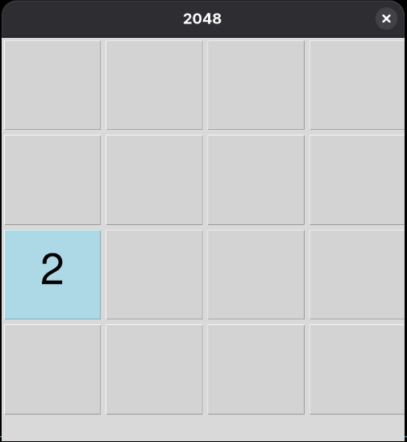

# 2048 Game (Python)

A simple implementation of the classic **2048** puzzle game built with **Python** and **Tkinter**.

## 🎮 About the Game

2048 is a single-player puzzle game played on a **4×4 grid**. The objective is to combine tiles with the same value to create a tile with the number **2048**.

After every move, a new tile (2 or 4) appears at a random empty position. The game ends when there are no valid moves left.

## ✨ Features

* Classic 2048 gameplay
* Graphical interface built with Tkinter
* Random tile generation
* Score tracking
* Keyboard controls
* Game Over detection

## 📦 Requirements

* Python 3.x
* Tkinter

### Fedora

```bash
sudo dnf install python3-tkinter
```

### Ubuntu/Debian

```bash
sudo apt install python3-tk
```

## 🚀 Installation

Clone the repository:

```bash
git clone https://github.com/musta-007/2048-game.git
cd 2048-game
```

Run the game:

```bash
python3 2048game.py
```

## 🎯 Controls

| Key | Action     |
| --- | ---------- |
| ↑   | Move Up    |
| ↓   | Move Down  |
| ←   | Move Left  |
| →   | Move Right |

## 📂 Project Structure

```text
├── 2048game.py
├── assets
│   ├── Screenshot-begin.png
│   ├── Screenshot-end.png
│   └── Screenshot-move-left.png
└── README.md
```

## 🛠️ Technologies Used

* Python
* Tkinter

## 📸 Screenshot

Example:

```text
assets
   ├── Screenshot-begin.png
   ├── Screenshot-end.png
   └── Screenshot-move-left.png
```





## 💡 Future Improvements

* High score saving
* Undo feature
* Sound effects
* Animations
* Dark mode
* Different board sizes (5×5, 6×6)
* Settings menu

## 🤝 Contributing

Contributions are welcome!

If you'd like to improve the project:

1. Fork the repository.
2. Create a new branch.
3. Commit your changes.
4. Open a Pull Request.

## 📄 License

This project is open source and available under the MIT License.

## 👨‍💻 Author

**Imourig**

GitHub: https://github.com/musta-007
